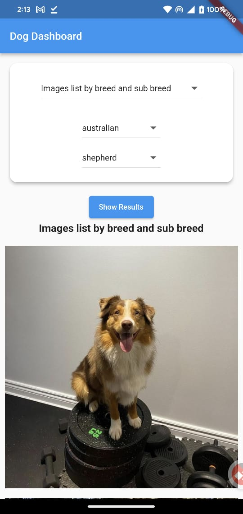

# dog_dashboard

Dog Dashboard
Dog Dashboard is a simple Flutter app that allows you to explore dog breeds and view dog images based on your selections.

## Description

Features
View a list of dog breeds.
Select a breed and sub-breed from the dropdown menus.
Choose from various options such as random image or image lists.
View dog images based on your selections.

## App Architecture -- Clean Architecture
lib: Contains the main application code.
    main.dart: The entry point of the app.
    features: This directory contains the core app features.
    data: Data layer.
    domain: Domain layer.
    presentation: UI layer.
    widgets: Reusable widgets used in the presentation layer.
    core: Contains core functionality and utilities.
    network: Networking-related code, including the Api class.

## Dependencies
flutter_lints: ^2.0.0
    http: 1.0.0

## Screenshots

## Prerequisites
- [Flutter](https://flutter.dev/) and [Dart](https://dart.dev/) must be installed on your system. (Flutter SDK version 3.10.4 is recommended.)
- A code editor, such as [Android Studio or Visual Studio] is recommended.
##Install dependencies:
Open source code in Android Studio
flutter pub get
flutter run
